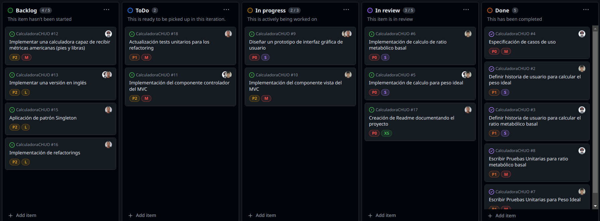

# CalculadoraCHUO

## Practica 8 
Gestión de proyecto de calculadora para el Complejo Hospitalario Universitario de Ourense (CHUO).

## Miembros

-  Diego De Pablo ([User: Diegodepab](https://github.com/Diegodepab))
-  Alejandro Silva Rodríguez ([User: AlexSilvaa9](https://github.com/AlexSilvaa9))
-  Álvaro Gil Varela ([User: aalvarogv](https://github.com/aalvarogv))

# Tablero Kanban

El tablero muestra el flujo de trabajo de tareas dividido en cinco columnas: 

-	**Backlog** : tareas no iniciadas. 

-	**ToDo** : tareas listas para la iteración. 

-	**In Progress** : tareas en progreso. 

-	**In Review** : tareas en revisión.
 
-	**Done** : tareas completadas. 

Cada columna ayuda a visualizar el estado actual y el avance de las tareas del proyecto.

